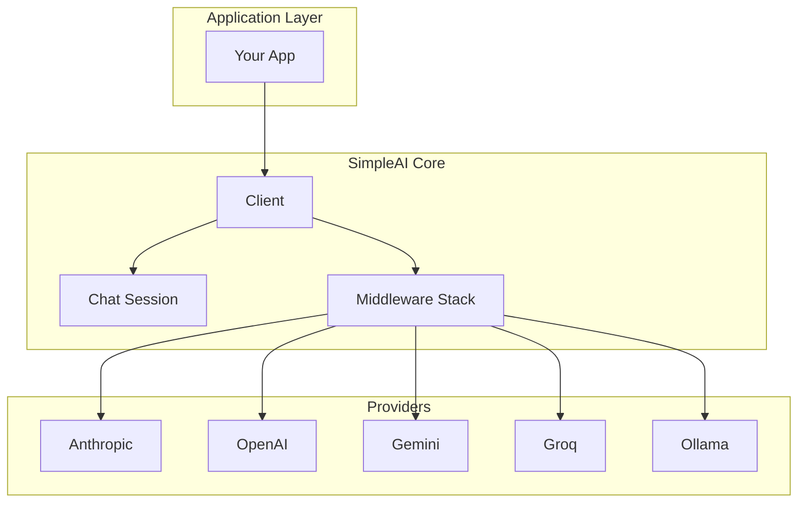

# SimpleAI Design Document

> A standalone AI wrapper library for the Meda ecosystem

## Overview

SimpleAI is a Go library that provides a unified interface for multiple AI providers. It is designed to work alongside other Meda libraries to build AI-powered applications.

```
simpleai + simplehttp + simpleorm + goutil + simpleauth = AI Apps
```

## Goals

- **Multi-provider support**: Anthropic, OpenAI, Gemini, Groq, Ollama
- **Streaming**: Real-time token streaming for all providers
- **Simplicity**: Easy-to-use API with sensible defaults
- **Extensibility**: Middleware support for retry, fallback, logging
- **Standalone**: Focused scope, integrates with other Meda libraries

## Architecture



## Scope

| In Scope | Out of Scope |
|----------|--------------|
| AI provider integrations | HTTP server (use simplehttp) |
| Chat/conversation logic | Database (use simpleorm) |
| Prompt templates | Logging (use goutil) |
| Streaming responses | Auth (use simpleauth) |
| Retry/fallback middleware | Rate limiting (use simplehttp) |

## Core Interfaces

### Provider

```go
type Provider interface {
    Complete(ctx context.Context, req *Request) (*Response, error)
    Stream(ctx context.Context, req *Request) (<-chan StreamEvent, error)
    CountTokens(text string) int
    Name() string
}
```

### Chat Session

```go
type Chat struct {
    client       *Client
    system       string
    history      []Message
    historyLimit int
}

func (c *Chat) Send(ctx context.Context, msg string) (*Response, error)
func (c *Chat) Stream(ctx context.Context, msg string) (<-chan StreamEvent, error)
```

## Providers

| Provider | Default Model | Use Case |
|----------|---------------|----------|
| Anthropic | claude-3-5-sonnet-20241022 | Primary, safety-focused |
| OpenAI | gpt-4o | General purpose |
| Gemini | gemini-1.5-pro | Multimodal, cost-effective |
| Groq | llama-3.3-70b-versatile | Fast inference |
| Ollama | llama3.2 | Local, privacy |

## Middleware

- **Retry**: Exponential backoff with jitter
- **Fallback**: Automatic provider failover
- **Logging**: Request/response logging

## Project Structure

```
simpleai/
├── simpleai.go         # Client facade
├── types.go            # Core types
├── chat.go             # Chat session
├── options.go          # Functional options
├── errors.go           # Error types
├── middleware.go       # Middleware interface
├── provider/           # Provider implementations
├── middleware/         # Middleware implementations
├── template/           # Prompt templates
└── examples/           # Usage examples
```

## Usage Example

```go
package main

import (
    "context"
    "os"
    
    "github.com/medatechnology/simpleai"
    "github.com/medatechnology/simpleai/provider"
    "github.com/medatechnology/simpleai/middleware"
)

func main() {
    // Create provider
    anthropic := provider.NewAnthropic(provider.AnthropicConfig{
        APIKey: os.Getenv("ANTHROPIC_API_KEY"),
    })
    
    // Create client with middleware
    client := simpleai.NewClient(anthropic,
        simpleai.WithMiddleware(middleware.RetrySimple(3)),
    )
    
    // Create chat session
    chat := client.NewChat(simpleai.WithSystem("You are helpful."))
    
    // Send message
    resp, _ := chat.Send(context.Background(), "Hello!")
    fmt.Println(resp.Content)
}
```

## Integration Pattern

```go
// Combine with other Meda libraries
import (
    "github.com/medatechnology/simpleai"
    "github.com/medatechnology/simplehttp"
    "github.com/medatechnology/simpleorm"
    "github.com/medatechnology/goutil/utils"
)

func main() {
    utils.LoadEnvEach(".env")
    
    ai := simpleai.NewClient(provider.NewAnthropic(...))
    db, _ := rqlite.NewDatabase(config)
    
    server := simplehttp.NewServer(...)
    server.POST("/chat", func(c simplehttp.Context) error {
        resp, _ := ai.NewChat(...).Send(c.Context(), req.Message)
        db.InsertOneTableStruct(ConversationLog{...}, false)
        return c.JSON(200, resp)
    })
}
```

## Status

✅ **Implemented** - All core features complete and verified.
